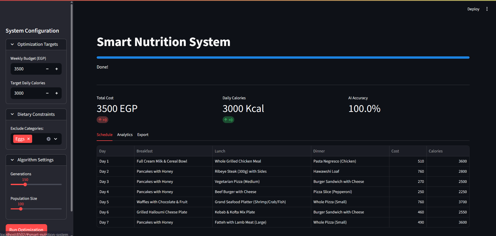
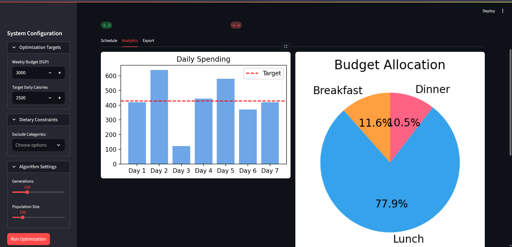
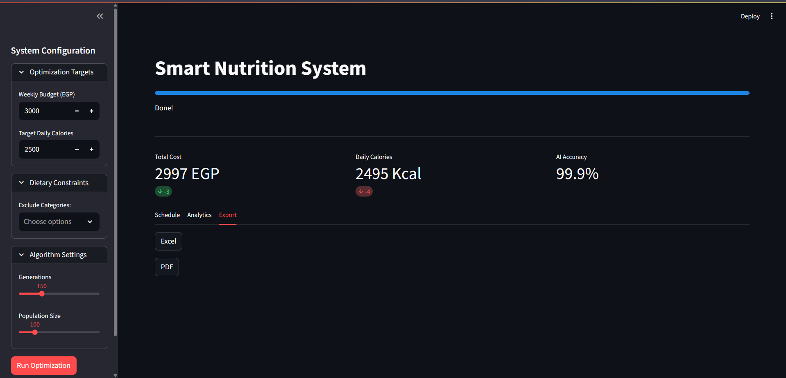
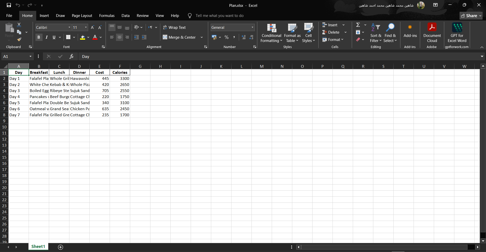

# Smart Nutrition System

[](https://www.python.org/)
[](https://streamlit.io/)
[](#license)
[](#)

**Genetic algorithm-driven meal planning optimizer that generates weekly nutrition schedules within budget and caloric constraints. Features smart-sampling heuristics, real-time convergence analysis, and comprehensive reporting for institutional and personal dietary planning.**

---

## Overview

Smart Nutrition System solves multi-objective meal planning through genetic algorithms. Users specify weekly budget and daily caloric targets with dietary preferences; the system generates optimized 7-day schedules that balance cost and nutrition simultaneously while respecting constraints. The optimization leverages context-aware meal selection (smart sampling) and real-time convergence visualization for interactive performance monitoring.

**Use Cases:** Healthcare nutrition planning, institutional cafeteria management, fitness meal prep, corporate wellness programs, nutritional research.

---

## Features

- Multi-Objective Optimization: Balances budget (50%) and caloric targets (50%)
- Genetic Algorithm Engine: Elitist selection, single-point crossover, adaptive mutation
- Smart Sampling Heuristics: Context-aware meal selection (heavy/light/standard goals)
- Soft Constraints: Meal variety penalties prevent plan repetition
- Interactive Dashboard: Real-time configuration, metrics, schedule, and analytics
- 120+ Meal Database: Diverse options (10-600 EGP, 70-2000 kcal range)
- Multi-Format Export: Generate Excel and PDF reports
- Real-Time Feedback: Live convergence curves and accuracy metrics (0-100%)

---

## Installation

### Prerequisites
- Python 3.8+
- pip package manager

### Quick Start

```bash
# Clone repository
git clone https://github.com/yourusername/smart-nutrition-system.git
cd smart-nutrition-system

# Create and activate virtual environment
python -m venv venv
source venv/bin/activate  # On Windows: venv\Scripts\activate

# Install dependencies
pip install streamlit pandas openpyxl fpdf matplotlib

# Generate meal database
python create_db.py

# Run application
streamlit run app.py
```

App launches at `http://localhost:8501`

---

## Usage

### Basic Workflow

1. **Configure Parameters** (Sidebar):
   - Set weekly budget (500-10,000 EGP)
   - Set daily calories (1,200-5,000 kcal)
   - Exclude dietary categories
   - Adjust algorithm: generations (50-400), population size (50-300)

2. **Run Optimization:**
   - Click "Run Optimization" button
   - Monitor real-time progress and accuracy percentage
   - Execution time: 5-30 seconds

3. **Review Results:**
   - View metrics: cost, daily calories, accuracy
   - Browse 7-day meal schedule with daily breakdown
   - Explore analytics: cost charts, budget allocation, convergence curve

4. **Export Plan:**
   - Download Excel spreadsheet or PDF report

### Code Example

```python
from app import load_and_filter_data, run_genetic_algorithm

# Load and filter data
b_df, l_df, d_df = load_and_filter_data(excluded_categories=['Seafood'])

# Run optimization
best_plan, history = run_genetic_algorithm(
    b_df, l_df, d_df,
    budget=3000,          # Weekly budget
    cal_target=2500*7,    # Weekly calories
    pop_size=100,         # Population size
    generations=200       # GA iterations
)

# Results
print(f"Cost: {best_plan.total_cost} EGP")
print(f"Calories: {best_plan.total_cal} kcal")
print(f"Accuracy: {best_plan.accuracy:.1f}%")
```

---

## Architecture

**Streamlit UI Layer:** Sidebar configuration, dashboard display, export functionality

**Genetic Algorithm Engine:**
- WeeklySchedule class: Encodes 7-day meal plans (21 meal selections)
- Fitness function: Weighted error (cost + calories) + variety penalties
- Selection: Elitist strategy (preserve top-10)
- Operators: Single-point crossover, 20% mutation rate
- Auto-goal detection: Heavy/Light/Standard based on caloric target

**Fitness Function:**

$$f(\text{Schedule}) = -\left[\frac{|B_t - B_a|}{B_t} \times 0.5 + \frac{|C_t - C_a|}{C_t} \times 0.5 + V_p\right]$$

**Accuracy:** `max(0, 100 × (1 - error))`

---

## Visualizations

### Dashboard Interface

**Configuration Interface**



**Results Metrics & Performance**



**7-Day Meal Schedule**



**Daily Cost Analysis**


**Budget Allocation**


**Optimization Convergence**



### Suggested Animations

- Algorithm Flow: GA loop animation (initialization → evaluation → selection → crossover → mutation)
- Real-Time Convergence: Live fitness score evolution across generations
- Meal Selection: Smart sampling process visualization
- Budget Shifts: Pie chart morphing as constraints change

---

## Algorithm Details

**Genetic Operators:**
- Selection: Elitist (top-10 preserved) + Tournament selection from top-20
- Crossover: Single-point at random day boundary (1-6)
- Mutation: 20% probability; regenerates random day for diversity

**Smart Sampling:**
```
IF goal == 'heavy': Select top-50% calorie meals
ELIF goal == 'light': Select bottom-50% calorie meals
ELSE: Uniform random selection
```

---

## Contributing

### How to Contribute
1. Fork repository and create feature branch
2. Follow PEP 8 style guidelines
3. Add docstrings and unit tests
4. Submit pull request with clear description

### Contribution Ideas
- Algorithm variants (PSO, Simulated Annealing, NSGA-II)
- Macro/micronutrient tracking
- Allergen and cultural/religious constraints
- Enhanced UI/UX and mobile adaptation
- International cuisine database expansion

---

## License

Licensed under the MIT License – see LICENSE for details.

**Permissions:** Commercial/personal use, modification, distribution  
**Requirements:** Include original license and copyright notice

---

## Credits

**Development Team:**
- Isaac: Data loading & constraint filtering
- Shaheen: WeeklySchedule class & fitness function
- Adam: Genetic operators (crossover, mutation)
- Eyad: Visualization & analytics
- Fady: Main application orchestration

**Technologies:** Streamlit, Pandas, Matplotlib, FPDF

---

**Last Updated:** January 2026 | **Status:** Active | **Version:** 1.0.0
