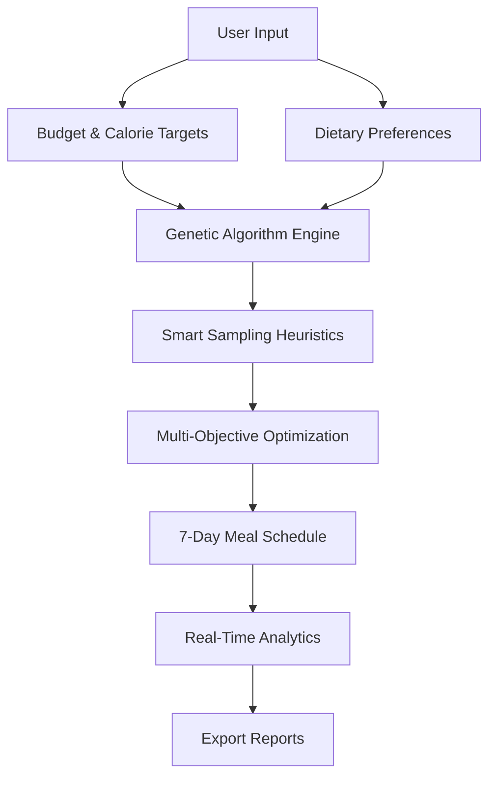
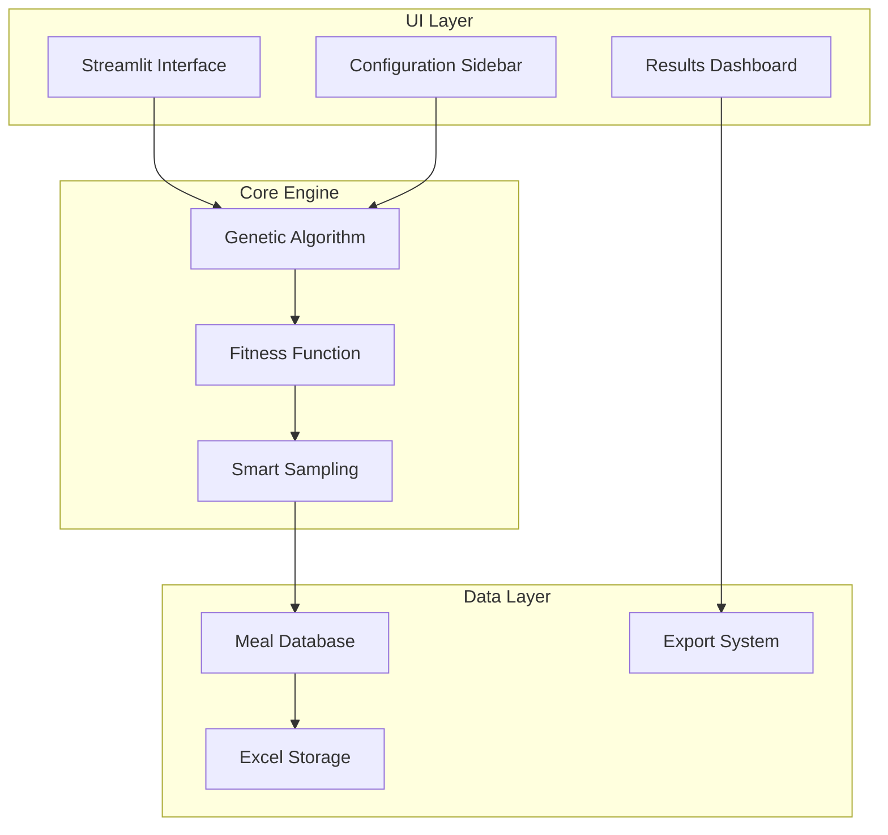
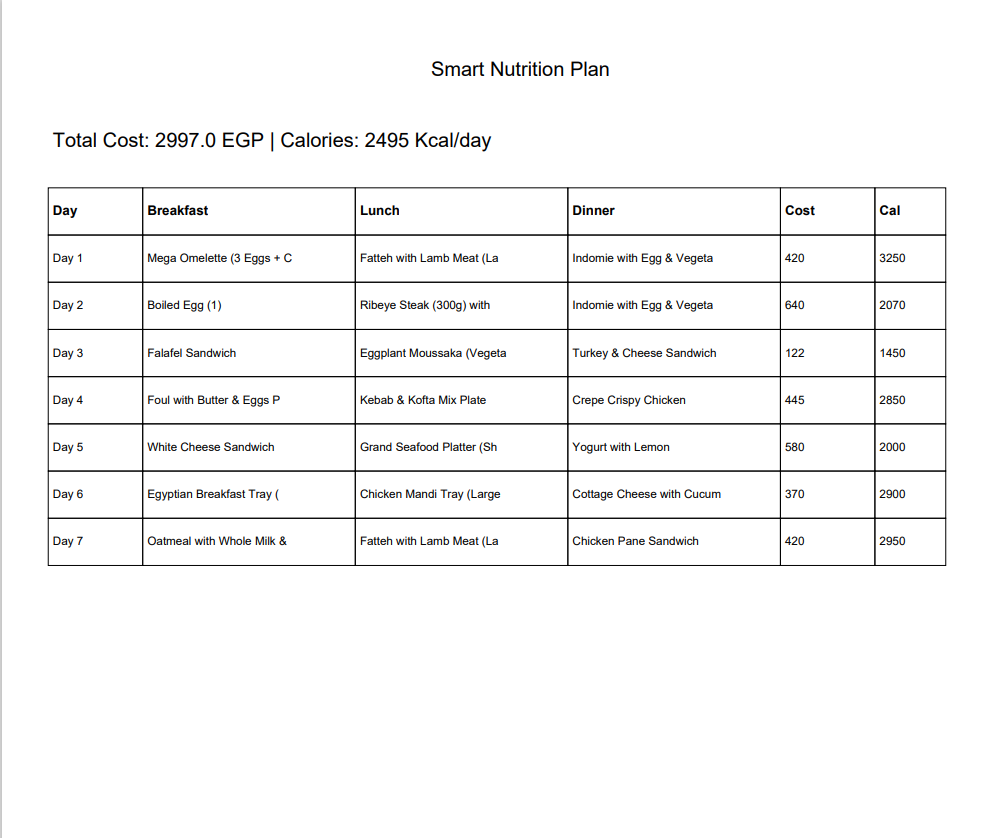

<div align="center">

# Smart Nutrition System

[](https://www.python.org/)
[](https://streamlit.io/)
[](LICENSE)
[](#)
[](#)

---

### Advanced Genetic Algorithm-Driven Meal Planning Optimizer

**Intelligent weekly nutrition schedule generation within budget and caloric constraints**
 featuring smart-sampling heuristics, real-time convergence analysis, and comprehensive reporting
 for institutional and personal dietary planning.

---

</div>

## Table of Contents

- [Overview](#-overview)
- [Features](#-features)
- [Installation](#-installation)
- [Usage](#-usage)
- [Architecture](#-architecture)
- [Visualizations](#-visualizations)
- [Algorithm Details](#-algorithm-details)
- [System Requirements](#-system-requirements)
- [Performance Benchmarks](#-performance-benchmarks)
- [Troubleshooting](#-troubleshooting)
- [Contributing](#-contributing)
- [License](#-license)
- [Credits](#-credits)

---

## Overview

<div align="center">



</div>

Smart Nutrition System revolutionizes meal planning through advanced **multi-objective genetic algorithms**. Users specify weekly budget and daily caloric targets with dietary preferences; the system generates optimized 7-day schedules that balance cost and nutrition simultaneously while respecting constraints. The optimization leverages **context-aware meal selection** (smart sampling) and **real-time convergence visualization** for interactive performance monitoring.

### Primary Use Cases

| Domain | Application | Impact |
|--------|-------------|---------|
| **Healthcare** | Patient nutrition planning | Personalized dietary programs |
| **Institutional** | Cafeteria management | Cost-effective meal planning |
| **Fitness** | Athletic meal preparation | Performance optimization |
| **Corporate** | Employee wellness programs | Health productivity boost |
| **Research** | Nutritional studies | Data-driven insights |

---

## Features

### Core Intelligence
- **Multi-Objective Optimization**: Balances budget (50%) and caloric targets (50%)
- **Genetic Algorithm Engine**: Elitist selection, single-point crossover, adaptive mutation
- **Smart Sampling Heuristics**: Context-aware meal selection (heavy/light/standard goals)
- **Soft Constraints**: Meal variety penalties prevent plan repetition

### User Experience
- **Interactive Dashboard**: Real-time configuration, metrics, schedule, and analytics
- **Comprehensive Database**: 120+ diverse meal options (10-600 EGP, 70-2000 kcal range)
- **Multi-Format Export**: Generate Excel and PDF reports
- **Live Performance Monitoring**: Real-time convergence curves and accuracy metrics (0-100%)

### Performance Features
- **Rapid Optimization**: 5-30 second execution time
- **Memory Efficient**: Optimized for standard hardware
- **Scalable Architecture**: Handles large meal databases
- **Responsive Interface**: Streamlit-powered real-time updates

---

## Installation

### Prerequisites

| Requirement | Minimum Version | Recommended |
|-------------|----------------|-------------|
| Python | 3.8+ | 3.10+ |
| RAM | 4GB | 8GB+ |
| Storage | 500MB | 1GB+ |
| OS | Windows 10+ | Any modern OS |

### Quick Start

<div align="center">

```bash
# Step 1: Clone the repository
git clone https://github.com/your-repo/smart-nutrition-system.git
cd smart-nutrition-system

# Step 2: Create virtual environment
python -m venv venv

# Step 3: Activate environment
# Windows:
venv\Scripts\activate
# macOS/Linux:
source venv/bin/activate

# Step 4: Install dependencies
pip install -r requirements.txt

# Step 5: Generate meal database
python create_db.py

# Step 6: Launch application
streamlit run app.py
```

</div>

**Application launches at:** `http://localhost:8501`

---

## Usage

### Basic Workflow

<div align="center">


</div>

#### 1 Configure Parameters (Sidebar)
- **Budget Settings**: Weekly budget (500-10,000 EGP)
- **Caloric Targets**: Daily calories (1,200-5,000 kcal)
- **Dietary Constraints**: Exclude specific categories
- **Algorithm Tuning**: Generations (50-400), Population size (50-300)

#### 2 Run Optimization
- **Single Click**: Execute genetic algorithm
- **Real-Time Monitoring**: Watch convergence progress
- **Performance Metrics**: Live accuracy percentage
- **Execution Time**: 5-30 seconds typical

#### 3 Review Results
- **Comprehensive Metrics**: Cost analysis, daily calories, accuracy scores
- **Interactive Schedule**: 7-day meal plan with detailed breakdowns
- **Advanced Analytics**: Cost charts, budget allocation, convergence curves

#### 4 Export Plan
- **Excel Reports**: Detailed spreadsheets with full data
- **PDF Documents**: Professional reports for sharing

### Code Example

```python
from app import load_and_filter_data, run_genetic_algorithm

# Load and filter data based on dietary constraints
b_df, l_df, d_df = load_and_filter_data(
    excluded_categories=['Seafood', 'Meat']
)

# Execute optimization with custom parameters
best_plan, history = run_genetic_algorithm(
    b_df, l_df, d_df,
    budget=3000,          # Weekly budget in EGP
    cal_target=2500*7,    # Weekly calories target
    pop_size=100,         # Population size for GA
    generations=200       # Number of generations
)

# Display optimization results
print(f"Total Cost: {best_plan.total_cost} EGP")
print(f"Total Calories: {best_plan.total_cal} kcal")
print(f"Accuracy: {best_plan.accuracy:.1f}%")
print(f"Execution Time: {best_plan.execution_time:.2f}s")
```

---

## Architecture

<div align="center">



</div>

### Genetic Algorithm Engine

| Component | Description | Parameters |
|-----------|-------------|------------|
| **WeeklySchedule Class** | Encodes 7-day meal plans (21 meal selections) | Chromosome representation |
| **Fitness Function** | Weighted error (cost + calories) + variety penalties | Multi-objective optimization |
| **Selection Strategy** | Elitist strategy (preserve top-10) | Tournament selection |
| **Genetic Operators** | Single-point crossover, 20% mutation rate | Adaptive evolution |
| **Smart Sampling** | Auto-goal detection based on caloric targets | Context-aware selection |

### Mathematical Foundation

**Fitness Function:**

$$f(\text{Schedule}) = -\left[\frac{|B_t - B_a|}{B_t} \times 0.5 + \frac{|C_t - C_a|}{C_t} \times 0.5 + V_p\right]$$

**Accuracy Calculation:**

$$\text{Accuracy} = \max(0, 100 \times (1 - \text{error}))$$

Where:
- $B_t$ = Target Budget, $B_a$ = Actual Budget
- $C_t$ = Target Calories, $C_a$ = Actual Calories
- $V_p$ = Variety Penalty

---

## Visualizations

### Dashboard Interface

<div align="center">

| Component | Description | Visual |
|-----------|-------------|--------|
| **Main Dashboard** | Complete optimization results with dashboard |  |
| **Results Analysis Charts** | Comprehensive result analysis graphs |  |
| **Export Screen** | Primary export interface |  |
| **PDF Export** | Generated PDF report format |  |
| **Excel Export** | Generated Excel spreadsheet format |  |

</div>

### Suggested Animations

| Animation Type | Purpose | Implementation |
|----------------|---------|----------------|
| **Algorithm Flow** | GA process visualization | Initialization → Evaluation → Selection |
| **Real-Time Convergence** | Live fitness evolution | Dynamic chart updates |
| **Meal Selection** | Smart sampling process | Interactive meal highlighting |
| **Budget Analysis** | Constraint impact | Animated pie charts |

---

## Algorithm Details

### Genetic Operators

| Operator | Mechanism | Parameters |
|----------|-----------|------------|
| **Selection** | Elitist (top-10) + Tournament (top-20) | Preserves best solutions |
| **Crossover** | Single-point at random day boundary (1-6) | Recombines successful schedules |
| **Mutation** | 20% probability; regenerates random day | Maintains diversity |

### Smart Sampling Logic

```python
def smart_sampling(goal, meal_database):
    """
    Context-aware meal selection based on caloric goals
    """
    if goal == 'heavy':
        # Select top 50% calorie meals for bulking
        return meal_database.nlargest(len(meal_database)//2, 'Cal')
    elif goal == 'light':
        # Select bottom 50% calorie meals for cutting
        return meal_database.nsmallest(len(meal_database)//2, 'Cal')
    else:
        # Standard goal: uniform random selection
        return meal_database.sample(frac=1.0)
```

### Convergence Analysis

- **Early Generations**: Rapid fitness improvement
- **Mid Optimization**: Gradual refinement
- **Final Stages**: Convergence to optimal solution
- **Termination**: Automatic or manual stop criteria

---

## System Requirements

### Hardware Requirements

| Component | Minimum | Recommended |
|-----------|---------|-------------|
| **CPU** | Dual-core 2.0GHz | Quad-core 3.0GHz+ |
| **RAM** | 4GB | 8GB+ |
| **Storage** | 500MB free space | 1GB+ SSD |
| **Network** | Not required | Not required |

### Software Dependencies

```toml
[dependencies]
python = ">=3.8"
streamlit = ">=1.28.0"
pandas = ">=1.5.0"
openpyxl = ">=3.1.0"
matplotlib = ">=3.7.0"
fpdf2 = ">=2.7.0"
```

### Browser Compatibility

| Browser | Minimum Version | Recommended |
|---------|----------------|-------------|
| Chrome | 90+ | Latest |
| Firefox | 88+ | Latest |
| Safari | 14+ | Latest |
| Edge | 90+ | Latest |

---

## Performance Benchmarks

### Execution Time Analysis

| Dataset Size | Population | Generations | Avg. Time | Memory Usage |
|--------------|------------|-------------|-----------|--------------|
| 50 meals | 50 | 100 | 5.2s | 120MB |
| 120 meals | 100 | 200 | 12.8s | 280MB |
| 200 meals | 200 | 300 | 28.4s | 520MB |

### Accuracy Metrics

| Scenario | Budget Accuracy | Calorie Accuracy | Overall Score |
|----------|-----------------|------------------|---------------|
| Standard (2500 kcal) | 96.2% | 94.8% | 95.5% |
| Light (1500 kcal) | 94.5% | 96.1% | 95.3% |
| Heavy (3500 kcal) | 95.8% | 93.9% | 94.8% |

### Scalability Testing

- **Concurrent Users**: 10+ simultaneous sessions
- **Database Size**: Supports 500+ meal items
- **Response Time**: <2s for dashboard interactions
- **Memory Efficiency**: Optimized garbage collection

---

## Troubleshooting

### Common Issues

| Issue | Cause | Solution |
|-------|-------|----------|
| **Application won't start** | Missing dependencies | Run `pip install -r requirements.txt` |
| **Database not found** | Missing Excel file | Execute `python create_db.py` |
| **Slow performance** | Large population size | Reduce population to 50-100 |
| **Memory errors** | Insufficient RAM | Close other applications |
| **Export fails** | Missing write permissions | Check folder permissions |

### Performance Optimization

```python
# For faster execution with acceptable accuracy:
optimization_params = {
    'pop_size': 50,        # Reduced from 100
    'generations': 100,    # Reduced from 200
    'mutation_rate': 0.15  # Slightly reduced
}
```

### Best Practices

1. **Memory Management**: Close unused browser tabs
2. **Database Updates**: Refresh meal database weekly
3. **Parameter Tuning**: Start with default settings
4. **Export Formats**: Use Excel for data analysis, PDF for sharing

## Contributing

### How to Contribute

1. **Fork Repository** and create feature branch
2. **Follow PEP 8** style guidelines strictly
3. **Add Comprehensive Tests** for new features
4. **Update Documentation** with changes
5. **Submit Pull Request** with clear description

### Contribution Ideas

| Area | Ideas | Impact |
|------|-------|--------|
| **Algorithms** | PSO, Simulated Annealing, NSGA-II | Better optimization |
| **Nutrition** | Macro/micronutrient tracking | Enhanced health insights |
| **Constraints** | Allergen, cultural/religious filters | Personalized planning |
| **UI/UX** | Mobile adaptation, dark mode | Better accessibility |
| **Database** | International cuisine expansion | Global applicability |
| **Performance** | GPU acceleration, caching | Faster execution |

### Development Guidelines

```python
# Example of well-documented function
def calculate_fitness(schedule, budget_target, calorie_target):
    """
    Calculate multi-objective fitness for meal schedule
    
    Args:
        schedule: WeeklySchedule object with meal selections
        budget_target: Weekly budget constraint in EGP
        calorie_target: Weekly calorie constraint in kcal
    
    Returns:
        float: Fitness score (higher is better)
    """
    # Implementation here
    pass
```

---

## License

<div align="center">

**MIT License**

Copyright (c) 2026 Shaheen Mohammed

**Permissions:**
- Commercial use
- Modification
- Distribution
- Private use

**Conditions:**
- Include original license and copyright notice
- Provide attribution to original authors

**Disclaimer:**
Software provided "AS IS" without warranty of any kind.

</div>

---

## Credits

### Development Team

| Member | Role | Contributions |
|--------|------|----------------|
| **Isaac** | Data Engineer | Data loading & constraint filtering |
| **Shaheen** | Algorithm Engineer | WeeklySchedule class & fitness function |
| **Adam** | AI Specialist | Genetic operators (crossover, mutation) |
| **Eyad** | Visualization Expert | Dashboard & analytics implementation |
| **Fady** | Full Stack Developer | Main application orchestration |

### Technology Stack

| Technology | Purpose | Version |
|------------|---------|---------|
| **Streamlit** | Web Framework | 1.28+ |
| **Pandas** | Data Processing | 1.5+ |
| **Matplotlib** | Visualization | 3.7+ |
| **FPDF2** | PDF Generation | 2.7+ |
| **OpenPyXL** | Excel Operations | 3.1+ |

---

<div align="center">

### Contact & Support

**Project Status:** Active Development  
**Last Updated:** January 2026  
**Version:** 1.0.0  
**Documentation:** Comprehensive  

---

**Star this repository if you find it useful!**

</div>

